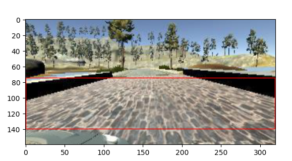

# Behavioral Cloning Project

In this project of the Udacity [Self-Driving Car NanoDegree](https://www.udacity.com/course/self-driving-car-engineer-nanodegree--nd013) program, I implement a Convolutional Neural Network (CNN) in [Keras](https://keras.io/) and train it to enable autonomous driving by predict steering angles from camera images in a self-driving car simulator.

The goals of this project are the following:
* Use the simulator to collect data of good driving behavior 
* Design, train and validate a model that predicts a steering angle from image data
* Use the model to drive the vehicle autonomously around the first track in the simulator. The vehicle should remain on the road for an entire loop around the track.
* Summarize the results with a written report (continue reading this file)

   
   

## Resources
* [Self-Driving Car NanoDegree](https://www.udacity.com/course/self-driving-car-engineer-nanodegree--nd013) course description at Udacity
* [Behavioral Cloning Project](https://github.com/udacity/CarND-Behavioral-Cloning-P3) template on Github
* [Udacity's Self-Driving Car Simulator](https://github.com/udacity/self-driving-car-sim) on Github

## Summary

The [model.py](model.py) script contains the commented code for training and saving the convolution neural network. When executed on the command line, it will provide instructions on supported command line arguments, such as the directory containing training data and several hyper parameters.

The script to drive the car [drive.py](drive.py) has not been modified from its original version provided by Udacity - all image preprocessing steps are contained within the Keras model itself.

### Model Architecture and Training Strategy

#### 1. Model Architecture

The CNN model implemented in [model.py](model.py), function `create_model()`, is largely based on NVIDIA's architecture presented in their paper "End to End Learning for Self-Driving Cars" (https://arxiv.org/pdf/1604.07316v1.pdf).
It involves a series of convolutional layers with strides (code line 133-137) and a series of fully connected dense layers (line 143-153).

Nonlinearity is introduced by adding RELU activation to the convolutional layers.
Overfitting is effectively avoided by adding dropout layers before each fully connected layer with a configurable rate of 0.2 each (line 143-153).

On the input side of the network, the data is normalized to a range between [-0.5, 0.5] (line 127) and cropped to the relevant vertical portion of interest (line 130).
On the output side a single fully connected node is added, representing the predicted steering angle value (line 153).

One more difference to the model presented by NVIDIA is the larger horizontal stride of '3' in the first convolutional layer (line 133). This compensates the larger image width of 320 pixels used in this project and together with the vertical cropping brings down the dimensionality of the model to a similar order of magnitude as in the NVIDIA paper.

For a graphical overview of all layers including their shapes please see the diagram provided on the right ([data/model.png](model.png)).

#### 2. Model parameter tuning

The model uses an Adam optimizer, with the loss function being the mean squared error between label and prediction (line 232).
With such a setup the initial default learning rate of 0.001 is adapted dynamically during training.

#### 3. Model training and validation

20% of the shuffled training data was reserved for validation. The loss of both training and validation data is monitored across training epochs to assess signs of overfitting. After typically 20-40 epochs no further significant improvement of validation loss was seen.

Note: The training data has additional augmentation applied (see next section), which explains the higher loss compared to the validation data, seen in the above diagram.

#### 4. Training data augmentation

The recorded training data is augmented both offline and online before fed to the CNN:
1. In function `parse_driving_logs()` (line 37) the CSV logs from the driving simulator are parsed and the respective images for left, center and right camera angles are resolved. A fixed (but configurable) steering angle correction is applied to the label for left and right camera images (line 91-94).
2. After that, each image is flipped horizontally and a copy is written to the filesystem (only during the first run) and the assigned label's sign is reversed. Effectively, the amount of usable training data is doubled. (Performing this step offline is necessary in order to prepare a simple list of tuples (filename, label) for the Keras `ImageDataGenerator` used in the next stage.)
3. Both training and validation data are piped to the model via instances of the [Keras `ImageDataGenerator`](https://keras.io/api/preprocessing/image/) (line 212-223). These generators will create batches of input data and read the required image data from disk on the fly. In case of the training data, in-place augmentation is applied to better generalize the model (and again counteract overfitting):
    * Random rotation in a range of [-5.0, 5.0] degree is applied.
    * Random image shear in a range of [-5.0, 5.0] degree is applied.
    * Random amount of relative zoom in the range of [-0.05, 0.05] is performed.

The following pictures show examples of model input, as they are provided by the training data generator. The area cropped by the input layer of the CNN is highlighted in red.

   
   
   
   
   

Using the Keras `ImageDataGenerator` has the advantage, that the expensive transformations performed on the input images can be parallelized across multiple workers (line 250).

### Training Strategy

The training data was recorded using the self-driving car simulator on both track 1 and 2. On track 1 I did my best to keep the car centered on the single lane while on track 2 I tried to keep the car centered on the right line. For both tracks I paused recording after on lap, turned the car around and drove the circuit reversed.

In addition to these "happy cases", I recorded several recovery scenarios with the car not being on center anymore. In order to not teach the model on how to steer of-center, I would stop recording, before moving the car closer to the lane border at an angle. I then corrected steering to point towards the center again and resume recording before putting the car in motion again. Once the car was oriented properly again, I would stop recording.

These recovery data proved to make the autonomous driving behavior a lot more robust, especially in sharp corners of the circuit.

In total I ended up with 33.177 of raw training images (equally divided in left, center and right camera angles). By flipping each image in the offline augmentation stage, this number doubled to 66.354 images. Only 80% out of those were used for actual training, which makes about 53.083 images.

With regards to the training data generator the number of steps per epoch is configured to use each of those images twice per epoch (code line 240).

The [data/model.h5](data/model5.h) file uploaded to this repository, was trained with 40 epochs and a batch size of 64.

### Testing Autonomous Driving Mode

The trained model was tested using the unmodified [drive.py](drive.py) script from Udacity.
The Conda environment required some modifications ([environment.yml](environment.yml])) on my local machine (Ubuntu 20.10) to make the simulator communicate with [drive.py](drive.py) in autonomous mode properly.

Both in tracks 1 and 2 the vehicle managed to stay within its lane throughout at least one complete circuit each:
* [MP4 recording of track 1](data/track1.mp4)
* [MP4 recording of track 2](data/track2.mp4)

It seems that the additional recording of recovery data and the online data augmentation strategy helped in generalizing the model to a point, that made it adequate to the task of driving the vehicle through the challenging track 2 of the simulator.

   
   

## Dependencies
The implementation of this project was performed in a [Conda](https://docs.conda.io/projects/conda/en/latest/) lab environment provided by Udacity:
* [CarND Term1 Starter Kit](https://github.com/udacity/CarND-Term1-Starter-Kit)

## Structure

* [README.md](README.md): this file, including the project writeup
* [model.py](model.py): Python script for training and saving the Keras model
* [drive.py](drive.py): Python script connecting to the simulator and driving the car autonomously based on the trained model
* [video.py](video.py): Python script for creating MP4 videos when driving autonomously
* [data/model.h5](data/model5.h): The trained Keras model in HDF5 format
* [data/track1.mp4](data/track1.mp4): Video recording of the simulator driving around track 1 autonomously
* [data/track2.mp4](data/track2.mp4): Video recording of the simulator driving around track 2 autonomously
* [examples/*](examples): Supplemental images for this writeyp
* [environment.yml](environment.yml]): Conda environment definition file based on the [CarND Term1 Starter Kit](https://github.com/udacity/CarND-Term1-Starter-Kit), but with more recent versions of TensorFlow and Keras

## License
The contents of this repository are covered under the [MIT License](LICENSE).
